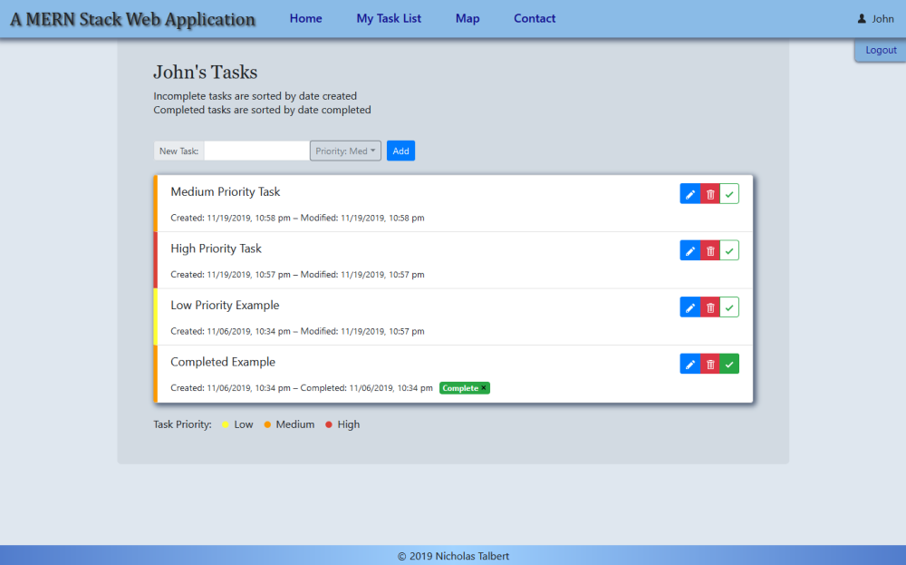
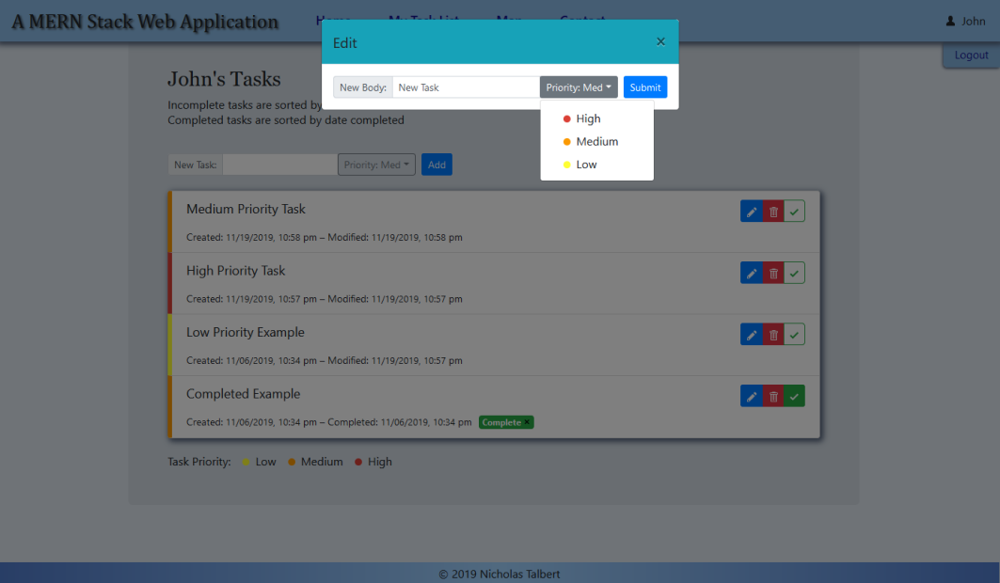
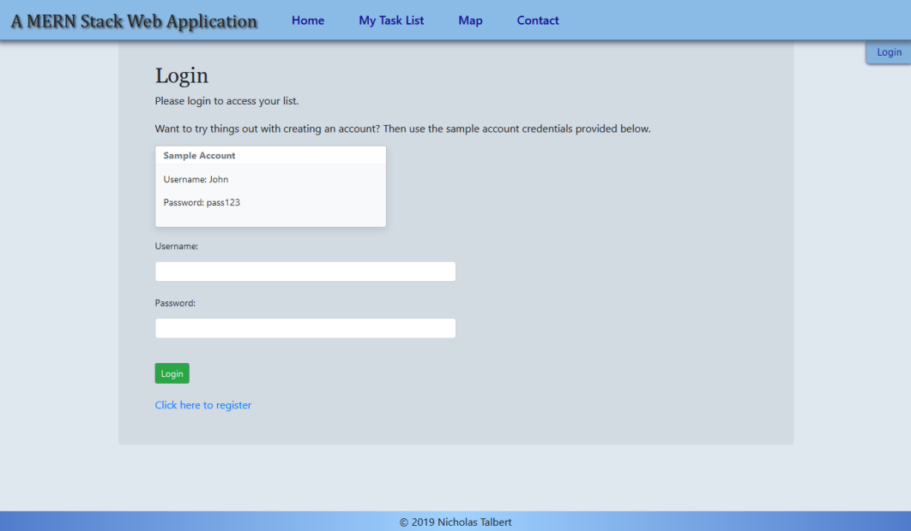
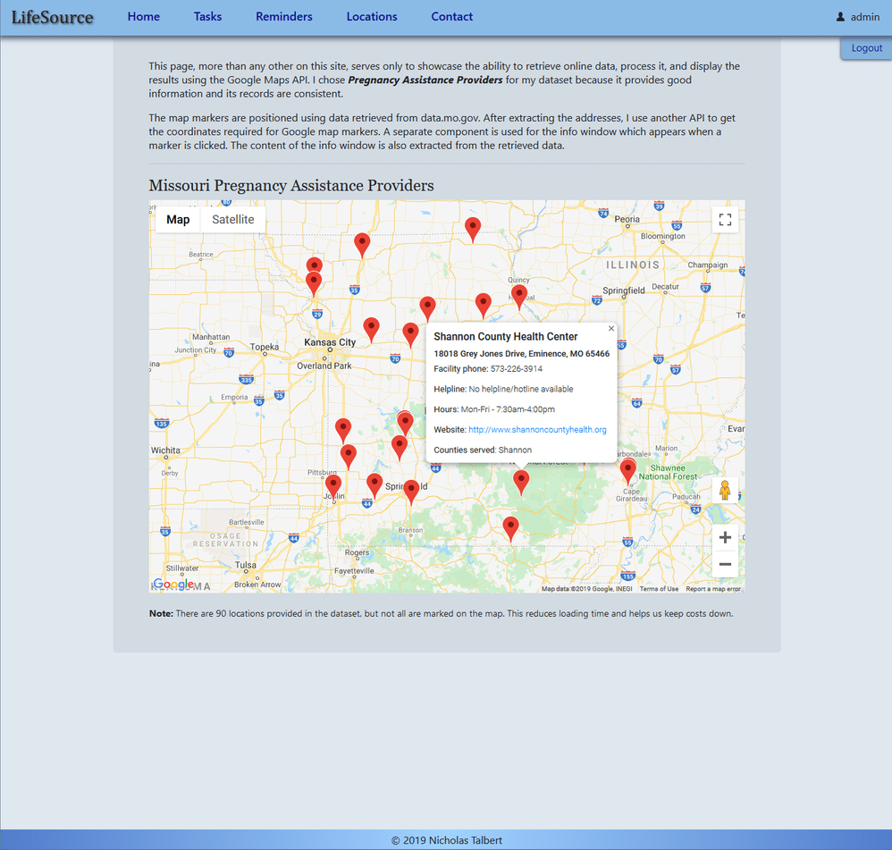

# mern-app #
My MERN web application, which has various utilities. Development is ongoing.

See it on Heroku: [https://taskanize.herokuapp.com]

## Built With ##
* MongoDB
* Express.js
* React
* Node.js

#### Screenshots ####
Note: These screenshots do not necessarily reflect the latest update 

